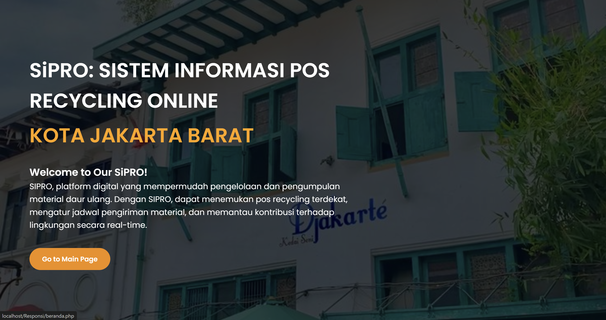
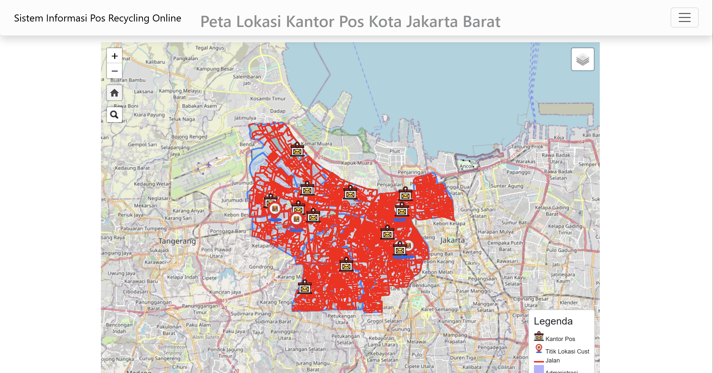
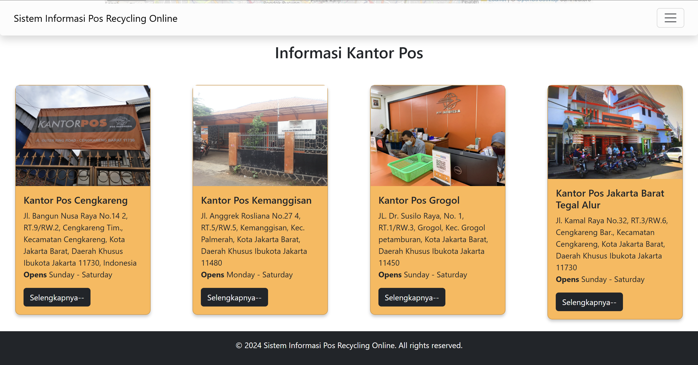
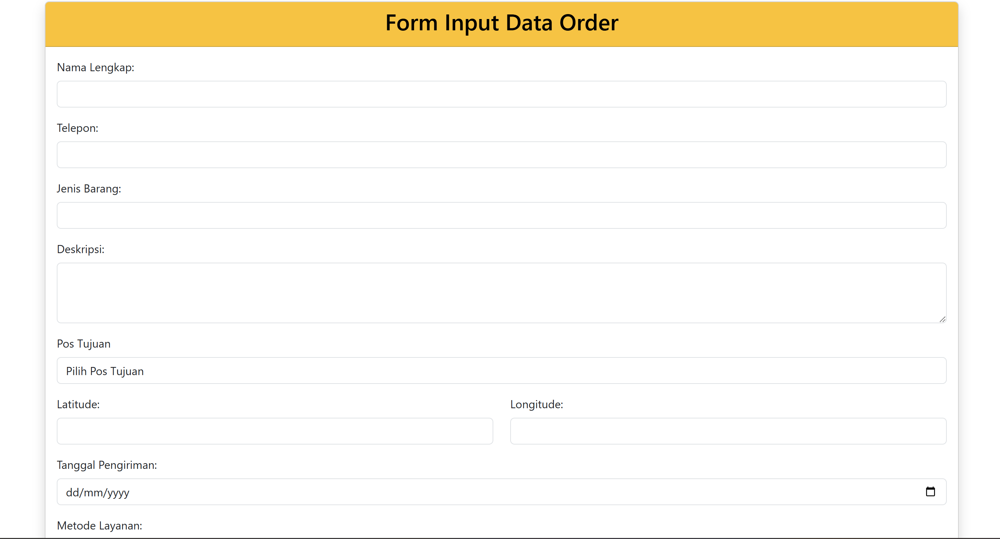
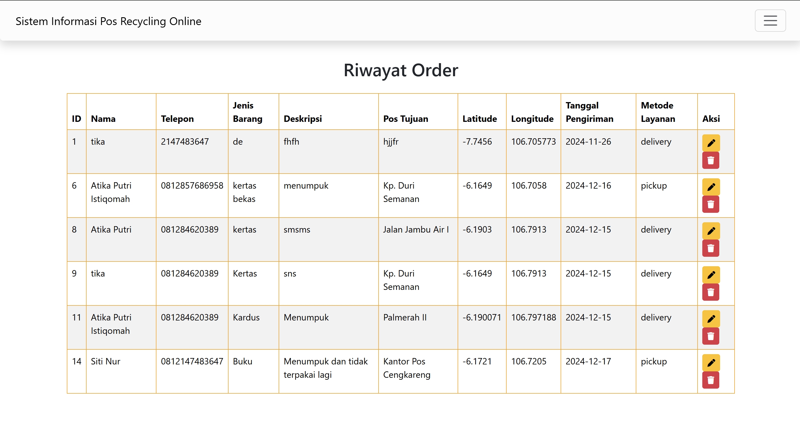

# SiPRO: Sistem Informasi Pos Recycling Online

SiPRO merupakan teknologi yang menghubungkan masyarakat Jakarta Barat dengan layanan pos daur ulang melalui platform web yang mudah digunakan. Dengan menyediakan akses ke peta interaktif lokasi kantor pos di Kota Jakarta Barat, layanan pickup dan delivery, serta fitur riwayat order, SiPRO juga menawarkan cara yang efisien dan praktis untuk mendaur ulang barang bekas. 

# Tujuan Pembuatan
Website ini dibuat untuk memberikan informasi persebaran kantor pos di Kota Jakarta Barat, serta dapat menggunakan layanan untuk mendaur-ulang barang bekas secara online. Apabila pengguna memiliki barang bekas dapat disampaikan pada form layanan untuk ditindak lanjuti. 

# Komponen Pembangun 
Website SiPRO ini merupakan aplikasi web yang dirancang untuk memvisualisasikan persebaran kantor pos, dengan fitur utama berupa peta interaktif yang menampilkan lokasi kantor pos terdekat. Website ini dibangun dengan menggunakan HTML5, JavaScript, CSS3, Leaflet.js untuk peta interaktif, juga PHP dan MySQL untuk backend dan penyimpanan data. Serta menampilkan peta menggunakan OpenStreetMap sebagai sumber peta dasar.

# Sumber Data
Geoportal Jakarta https://jakartasatu.jakarta.go.id/ 
Indonesia Geospasial https://www.indonesia-geospasial.com/ 

# Fitur Web
~ Landing Page

~Home Page

~ Order Page

~ History Page

~ Profile Page

